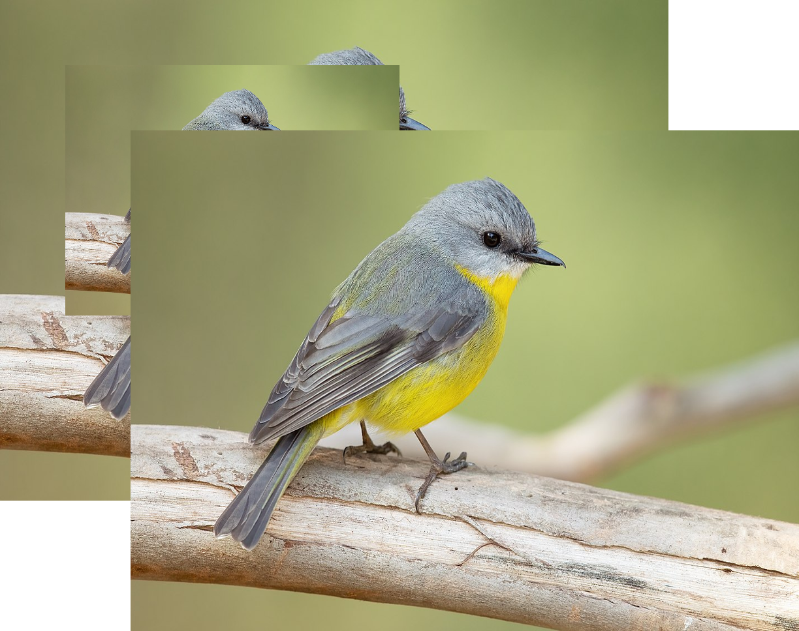

# render-img-ms

Render image based on base64 input

Example:
`W3sidXJsIjoiaHR0cHM6Ly91cGxvYWQud2lraW1lZGlhLm9yZy93aWtpcGVkaWEvY29tbW9ucy90aHVtYi80LzQ1L0VvcHNhbHRyaWFfYXVzdHJhbGlzXy1fTW9nb19DYW1wZ3JvdW5kLmpwZy8xMjAwcHgtRW9wc2FsdHJpYV9hdXN0cmFsaXNfLV9Nb2dvX0NhbXBncm91bmQuanBnIiwgIngiOiAwLCAieSI6IDAsICJ3aWR0aCI6IDEwMjQsICJoZWlnaHQiOiA3Njh9LHsidXJsIjoiaHR0cHM6Ly91cGxvYWQud2lraW1lZGlhLm9yZy93aWtpcGVkaWEvY29tbW9ucy90aHVtYi80LzQ1L0VvcHNhbHRyaWFfYXVzdHJhbGlzXy1fTW9nb19DYW1wZ3JvdW5kLmpwZy8xMjAwcHgtRW9wc2FsdHJpYV9hdXN0cmFsaXNfLV9Nb2dvX0NhbXBncm91bmQuanBnIiwgIngiOiAxMDAsICJ5IjogMTAwLCAid2lkdGgiOiA1MTIsICJoZWlnaHQiOiAzODR9LHsidXJsIjoiaHR0cHM6Ly91cGxvYWQud2lraW1lZGlhLm9yZy93aWtpcGVkaWEvY29tbW9ucy90aHVtYi80LzQ1L0VvcHNhbHRyaWFfYXVzdHJhbGlzXy1fTW9nb19DYW1wZ3JvdW5kLmpwZy8xMjAwcHgtRW9wc2FsdHJpYV9hdXN0cmFsaXNfLV9Nb2dvX0NhbXBncm91bmQuanBnIiwgIngiOiAyMDAsICJ5IjogMjAwLCAid2lkdGgiOiAxMDI0LCAiaGVpZ2h0IjogNzY4fV0=`

## Usage

Install `Lein` from `https://github.com/technomancy/leiningen`

### Debug
Run by command: `lein repl` 
After that run: `(start)`

### Production
Run by command in case(s):
- Run by docker: `docker-compose up`, stop docker by `docker-compose down`
- Run by lein: `lein run`

### Result
Open `http://localhost:2323/index.html` for a swagger UI 
We use api
- `http://localhost:2323/render/{base64}` - return a png image
- `http://localhost:2323/render/memoize/{base64}` - return a memoize png image

Example result:

## License

Copyright © 2022 FIXME

This program and the accompanying materials are made available under the
terms of the Eclipse Public License 2.0 which is available at
http://www.eclipse.org/legal/epl-2.0.

This Source Code may also be made available under the following Secondary
Licenses when the conditions for such availability set forth in the Eclipse
Public License, v. 2.0 are satisfied: GNU General Public License as published by
the Free Software Foundation, either version 2 of the License, or (at your
option) any later version, with the GNU Classpath Exception which is available
at https://www.gnu.org/software/classpath/license.html.
